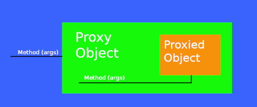

# What is a proxy object and what are the two different types of proxies Spring can create? What are the limitations of these proxies (per type)? What is the power of proxy object and where are the disadvantages?
Proxy Objects is an object that adds additional logic on top of the object that is being proxied without having to modify 
code of proxied object. Proxy objects have the same public methods as the object that is being proxied and it should be as 
much as possible indistinguishable from proxied object. When method is invoked on Proxy Object, additional code, usually
before and after sections are invoked, also code from proxied object is invoked by Proxy Object.

Spring Framework supports two kind of proxies:
- JDK Dynamic Proxy -> used by default if target object implements interface
- CGLIB Proxy -> used when target does not implement any interface

Limitations of JDK Proxy:
- Requires proxy object to implement the interface
- Only interface methods will be proxied
- No support for self invocation

Limitation of CGLIB Proxy:
- Does not work for final classes
- Does not work for final methods
- No support for self invocation

Proxy Advantages:
- Ability to change behaviour of existing beans without changing original code
- Separation of concerns(logging, transaction, security...)

Proxy Disadvantages:
- May create code hard to debug
- Needs to use unchecked exceptions for exceptions not declared in original methods
- May cause performance issues if before/after section in proxy code is using IO (Network, Disk)
- May cause unexpected equal operator (==) results since Proxy Object and Proxied Objects are two different objects
